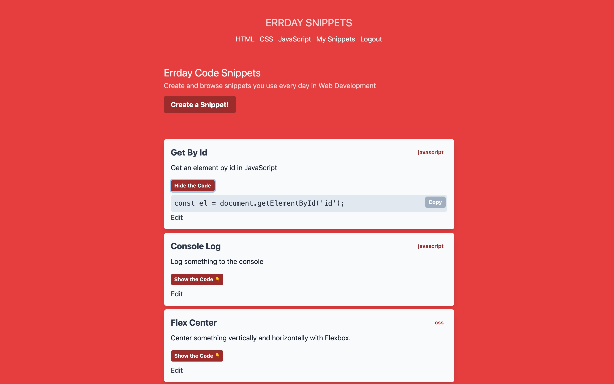

Source code for the [Next.js](https://nextjs.org/) crash course project that uses Tailwind CSS, SWR, React Hook Form, and FaunaDB!



## Getting Started

1. [Sign up for a free account at FaunaDB](http://bit.ly/jqqfauna).

2. Copy the `.env.local.example` file to `.env.local` and fill in your `FAUNA_SECRET`.

3. Create a collection in Fauna called `snippets`.

4. Run the development server:

```bash
npm run dev
# or
yarn dev
```

Open [http://localhost:3000](http://localhost:3000) with your browser to see the result.